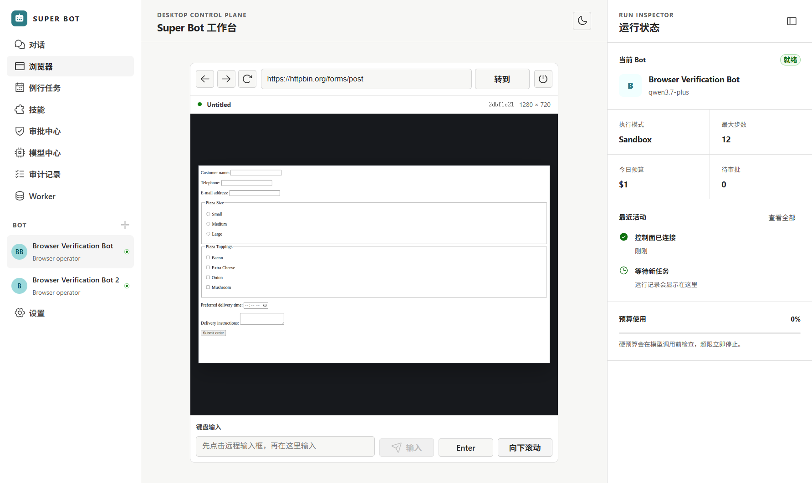

# Super Bot

Super Bot 是一个 Windows 优先、MIT 许可的持久化 AI 同事平台。它把聊天、长期 Bot、显式多模型路由、后台任务、审批、技能、定时例程、审计事件、产物和用量记录放在一个可自托管的桌面控制面中。

本项目不是 Grok Bot 的代码复制品，也不使用其品牌或私有实现；它根据公开产品行为重新设计了开放实现。公开文档显示，Grok Bot 的关键差异在于持久化具名 Bot、共享云计算机、工具/网站操作、多 Bot 协作、审批、技能与后台例程。Super Bot 保留这些产品原则，同时把模型、数据和部署控制权交给用户。

## 界面预览



上图是 Windows 桌面端连接真实 Playwright 容器后的运行画面：左侧管理长期 Bot 和功能入口，中间是可点击、可输入的远程网页画面，右侧持续显示当前 Bot、执行模式、步数、预算和活动状态。浏览器画面不是静态示例，地址导航、坐标点击、键盘输入、按键、滚动、前进、后退、刷新和关闭会话都会通过控制面发送到隔离浏览器。

## 核心功能

| 模块 | 功能介绍 |
| --- | --- |
| 持久化 Bot | 创建长期存在的具名 Bot，为每个 Bot 配置角色、模型、执行模式、最大步数、每日预算和显式 fallback；关闭桌面端后配置仍保存在 PostgreSQL。 |
| 对话与后台任务 | 从对话发起可恢复任务，通过事件时间线查看运行过程；支持取消、幂等提交、父子任务委派、失败恢复和 SSE 断线续传。 |
| 交互式远程浏览器 | 在独立 Playwright 容器中打开网页，将实时截图返回桌面端，并支持导航、点击、输入、按键、滚动、历史操作和会话关闭。桌面端不会直接连接浏览器 WebSocket。 |
| 多模型路由 | 支持 Qwen 3.7、DeepSeek、Kimi、GLM、MiniMax、SiliconFlow 和 Ollama；模型选择是显式的，只有用户配置的 fallback 才会触发回退。 |
| 工具与技能 | 提供文件和 HTTP 工具、MCP 扩展边界、版本化技能及工作区隔离；技能内容通过哈希记录，便于复现与审计。 |
| 定时例程 | 使用 IANA 时区和 Cron 表达式创建周期任务，由独立 Scheduler 到期派发，不依赖桌面窗口持续开启。 |
| 审批与安全策略 | 高风险动作可停在审批检查点；浏览器和 HTTP 工具默认阻止 localhost、私网、保留地址与云元数据地址。 |
| 审计、产物与用量 | 记录任务事件、浏览器动作和模型 token 用量；输入文本只保存脱敏标记及长度，文件产物写入 S3 兼容存储并记录 SHA-256。 |
| Windows 与容器部署 | 提供 Windows x64 Electron/NSIS 客户端和 Docker Compose 后端；PostgreSQL、Valkey、SeaweedFS、API、Worker、Scheduler 与浏览器运行时可分别部署。 |

### 交互浏览器数据链路

```text
Windows 桌面端
    → FastAPI 控制面（鉴权、会话、审计）
    → Browser Worker / Gateway（URL 策略、动作编排、截图）
    → Playwright Server（隔离 Chromium）
    → 目标网站
```

所有外部网页请求都经过 URL 与 DNS 检查；Playwright Server 和 Browser Gateway 只在 Compose 内部网络暴露。键盘输入会发送到当前远程焦点元素，但审计表不会保存输入原文。

## 技术实现

- Windows x64 Electron 桌面端，Fluent UI，亮/暗主题，Bot、会话、任务时间线、审批、模型、例程、审计和 Worker 视图。
- FastAPI 控制面，PostgreSQL 持久化，SSE 事件回放与 `Last-Event-ID` 断线续传。
- 可恢复任务、租约、审批检查点、取消、硬步数/预算边界、父子任务委派和幂等键。
- 文件与 HTTP 工具、MCP 适配边界、工作区路径隔离、私网/元数据地址阻断。
- 技能版本哈希、IANA 时区 Cron 例程、真实 Scheduler 派发、Worker 心跳。
- Qwen 3.7、DeepSeek、Kimi、GLM、MiniMax、SiliconFlow、Ollama；只有显式配置的 fallback 才会回退。
- 产物写入 S3 兼容存储并记录 SHA-256，模型 token 用量写入数据库。
- Docker Compose：PostgreSQL、Valkey、SeaweedFS、API、Worker、Scheduler，以及可选的远程 Playwright Server + Browser Gateway profile。
- 交互浏览器：远程截图、坐标点击、键盘输入、按键、滚动、导航历史、会话关闭、私网阻断和脱敏动作审计。
- NSIS Windows 安装器；Electron 开启 context isolation、sandbox，关闭 node integration。

浏览器模块使用与 Python 客户端严格匹配的 Playwright 1.61 远程协议；浏览器 profile 默认关闭，需要时单独启用。

## 快速开始

要求：Windows 10/11 x64、PowerShell 7、Docker Desktop、Node.js 22+、pnpm 10.32+、uv。

```powershell
Copy-Item .env.example .env
# 编辑 .env：至少设置 POSTGRES_PASSWORD、S3_ACCESS_KEY、S3_SECRET_KEY，
# 再设置要实际使用的模型供应商 Key。
pnpm install --frozen-lockfile
uv sync --frozen
.\scripts\dev.ps1
```

只启动后端：

```powershell
.\scripts\dev.ps1 -NoDesktop
```

启用远程交互浏览器：

```powershell
docker compose --profile browser up -d playwright-server browser-worker
```

如果 Clash/TUN 的 Fake-IP DNS 把公开域名解析到 `198.18.0.0/15`，在确认该网段确由本机可信 DNS 代理接管后设置 `SUPERBOT_BROWSER_TRUSTED_DNS_PROXY_CIDRS=198.18.0.0/15`；默认留空更安全。

生成 Windows 安装器：

```powershell
.\scripts\build-windows.ps1
```

安装器输出到 `apps/desktop/release/`。生产部署、备份和故障恢复见 [Windows 部署](docs/windows.md)。

## 质量门禁

```powershell
uv run ruff check .
uv run pytest -q
pnpm lint
pnpm test --run
pnpm build
docker compose config --quiet
pnpm --filter '@superbot/desktop' package:win
```

## 文档

- [产品与系统设计](docs/plans/2026-08-23-super-bot-design.md)
- [实现计划](docs/plans/2026-08-23-super-bot-implementation.md)
- [系统架构](docs/architecture.md)
- [模型供应商](docs/model-providers.md)
- [安全边界](docs/security.md)
- [Windows 与容器部署](docs/windows.md)

## 许可证

[MIT](LICENSE)。依赖组件保持各自许可证；部署前应按组织策略复核第三方依赖与模型供应商条款。
